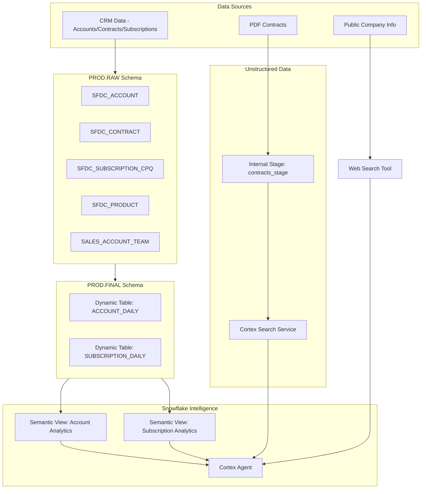

# Plan: Okta Customer 360 Demo for Snowflake Intelligence

## Overview

Build a complete Customer 360 demo environment for an identity company (Okta-style) that enables sales teams to answer questions about customer accounts, products, pricing, contracts, and expansion opportunities through Snowflake Intelligence Agents.

## Architecture



## Phase 1: Database and Source Data

### Task 1: Create Database and Raw Schema

**Location:** `PROD.RAW`

**Tables to create (simplified from [source_ddl.rtf](Source_Table_DDLs/source_ddl.rtf)):**

1. **SFDC_ACCOUNT** - Core account information
   - Key fields: ACCOUNT_ID, ACCOUNT_NAME, ACCOUNT_STATUS, BILLING_CITY, BILLING_STATE, TIMEZONE, GEOGRAPHY, INDUSTRY, CARR, RENEWAL_DATE, PARENT_ACCOUNT_ID

2. **SFDC_CONTRACT** - Contract details
   - Key fields: CONTRACT_ID, ACCOUNT_ID, START_DATE, END_DATE, CONTRACT_STATUS, TCV, CARR, MRR

3. **SFDC_SUBSCRIPTION_CPQ** - Subscription/product line items
   - Key fields: SUBSCRIPTION_ID, ACCOUNT_ID, PRODUCT_ID, PRODUCT_NAME, DISCOUNT, LIST_PRICE, CUSTOMER_PRICE, QUANTITY, ARR, MRR

4. **SFDC_PRODUCT** - Product catalog
   - Key fields: PRODUCT_ID, PRODUCT_NAME, PRODUCT_CODE, PRODUCT_FAMILY, PRODUCT_LINE, PRODUCT_CATEGORY

**Data generation requirements:**
- 200-300 USA-based accounts
- Spread across major timezones (Pacific, Mountain, Central, Eastern)
- Industries: Technology, Healthcare, Financial Services, Retail, Manufacturing

**Okta-style Products (from [pricing page](https://www.okta.com/pricing/)):**

| Product | Base Price | Description |
|---------|-----------|-------------|
| Single Sign-On (SSO) | $6/user/month | Secure one-click access |
| Multi-Factor Authentication (MFA) | $3/user/month | Basic MFA |
| Adaptive MFA | $6/user/month | Intelligent authentication |
| Universal Directory | $2/user/month | Unified user directory |
| Lifecycle Management | $8/user/month | Automated provisioning |
| API Access Management | $4/user/month | API security |
| Device Access | $5/user/month | Desktop authentication |
| Access Governance | $8/user/month | Access reviews |
| Privileged Access | $15/user/month | PAM solution |
| Workflows | $4/user/month | No-code automation |
| Identity Threat Protection | $5/user/month | AI-powered security |

### Task 2: Sales Account Team Table

**Table: SALES_ACCOUNT_TEAM**

```sql
CREATE TABLE PROD.RAW.SALES_ACCOUNT_TEAM (
    ACCOUNT_ID VARCHAR(18),
    ACCOUNT_EXECUTIVE_ID VARCHAR(18),
    ACCOUNT_EXECUTIVE_NAME VARCHAR(255),
    SOLUTIONS_ENGINEER_ID VARCHAR(18),
    SOLUTIONS_ENGINEER_NAME VARCHAR(255),
    SDR_ID VARCHAR(18),
    SDR_NAME VARCHAR(255),
    TERRITORY VARCHAR(50),
    REGION VARCHAR(50)
);
```

**Territory mapping:**
- Pacific: ~20 accounts per team
- Mountain: ~20 accounts per team
- Central: ~20 accounts per team
- Eastern: ~20 accounts per team

Generate 10-15 sales teams with realistic names.

## Phase 2: PDF Contracts

### Task 3: Generate PDF Contracts

**Storage:** `@PROD.RAW.CONTRACTS_STAGE` (directory internal stage)

**PDF contract structure:**
1. Header: Company logo, contract number, date
2. Customer information: Company name, buyer name, address
3. Product table:
   | Product | Quantity | List Price | Discount % | Net Price |
   |---------|----------|------------|------------|-----------|
   | SSO | 500 | $6.00 | 15% | $5.10 |
   | MFA | 500 | $3.00 | 10% | $2.70 |
4. Contract summary: TCV, ARR, term dates
5. Terms and conditions section

**File naming:** `contract_{CONTRACT_ID}_{ACCOUNT_NAME}.pdf`

Generate ~200-300 PDFs matching opportunities/contracts from Task 1.

## Phase 3: Final Schema and Transformations

### Task 4: Create Final Schema with Dynamic Tables

**Location:** `PROD.FINAL`

**Dynamic Table 1: ACCOUNT_DAILY** (based on [transformed_source_ddls.rtf](Source_Table_DDLs/transformed_source_ddls.rtf))

Key fields:
- DATE_PST, ACCOUNT_ID, ACCOUNT_NAME, ACCOUNT_STATUS
- CARR, CARR_USD, HEALTHSCORE, RENEWAL_DATE
- Geographic fields: GEOGRAPHY, BILLING_STATE, TERRITORY
- Sales team fields: ACCOUNT_OWNER_NAME, CSM_NAME

**Dynamic Table 2: SUBSCRIPTION_DAILY**

Key fields:
- DATE, ACCOUNT_ID, PRODUCT_ID, PRODUCT_NAME, PRODUCT_LINE
- LIST_PRICE, DISCOUNT, CUSTOMER_PRICE_USD
- MRR, ARR, TCV
- CONTRACT_NUMBER, CONTRACT_START, CONTRACT_END

**Transformation logic:**
- Join accounts with contracts and subscriptions
- Calculate daily snapshots
- Aggregate product-level metrics

## Phase 4: Cortex Search and Semantic Views

### Task 5: Cortex Search Service for PDFs

```sql
CREATE CORTEX SEARCH SERVICE PROD.FINAL.CONTRACT_SEARCH
  ON content
  ATTRIBUTES account_name, contract_id, product_list, total_value
  WAREHOUSE = DEFAULT_WH
  TARGET_LAG = '1 hour'
  AS (
    SELECT 
      content,
      account_name,
      contract_id,
      product_list,
      total_value
    FROM PROD.RAW.CONTRACT_CHUNKS
  );
```

**Use cases:**
- Search contract terms and conditions
- Find discount structures for specific products
- Retrieve customer-specific pricing

### Task 6: Semantic Views

**Semantic View 1: ACCOUNT_ANALYTICS**
- Answers: Account health, revenue metrics, renewal dates
- Sample questions:
  - "What is the CARR for customer X?"
  - "Which accounts are up for renewal in Q1?"
  - "Show me top accounts by region"

**Semantic View 2: SUBSCRIPTION_ANALYTICS**
- Answers: Product adoption, pricing, churn
- Sample questions:
  - "What products has my customer added or churned over time?"
  - "How has pricing and discounts changed over time?"
  - "What is the optimal discount for this customer?"
  - "What is the recommended next best product?"

**Semantic View 3: SALES_TEAM_ANALYTICS**
- Answers: Territory coverage, account assignments
- Sample questions:
  - "Who owns account X?"
  - "Show me all accounts for AE Y"

## Phase 5: Cortex Agent for Snowflake Intelligence

### Task 7: Create Cortex Agent

**Location:** `SNOWFLAKE_INTELLIGENCE.AGENTS.CUSTOMER_360_AGENT`

**Agent configuration:**
```json
{
  "models": {
    "orchestration": "claude-4-sonnet"
  },
  "instructions": {
    "orchestration": "You are a Customer 360 assistant for sales teams. Use structured_data tool for account metrics, pricing, and product questions. Use contract_search for contract terms and specific pricing details. Use web_search for public company information.",
    "response": "Be concise and data-driven. Always cite sources. Suggest follow-up actions when relevant."
  },
  "tools": [
    {"type": "cortex_analyst_text_to_sql", "name": "structured_data"},
    {"type": "cortex_search", "name": "contract_search"},
    {"type": "generic", "name": "web_search"}
  ]
}
```

### Task 8: Web Search Custom Tool

Create stored procedure for searching publicly available company information:
- LinkedIn company posts
- 10K/10Q SEC filings
- Recent business news and deals

## Sample Questions the Agent Will Answer

| Question | Tool Used | Data Source |
|----------|-----------|-------------|
| What products has my customer added or churned over time? | Cortex Analyst | SUBSCRIPTION_DAILY |
| How has pricing and discounts changed over time? | Cortex Analyst | SUBSCRIPTION_DAILY |
| Was the customer given a discount for buying product X? | Cortex Search | PDF Contracts |
| What is the optimal discount for this customer? | Cortex Analyst | SUBSCRIPTION_DAILY (aggregated) |
| What is the recommended next best product? | Cortex Analyst | SUBSCRIPTION_DAILY (pattern analysis) |
| Do related accounts have contracts with us? | Cortex Analyst | ACCOUNT_DAILY + SUBSCRIPTION_DAILY |
| What are the latest news about this company? | Web Search | Public sources |

## Deliverables

1. **PROD database** with RAW and FINAL schemas
2. **Source tables** with synthetic but realistic data
3. **PDF contracts** in internal stage (200-300 files)
4. **Dynamic tables** for data transformation
5. **Cortex Search service** for contract retrieval
6. **Semantic views** for structured data queries
7. **Cortex Agent** in Snowflake Intelligence

## Dependencies

- Snowflake account with Cortex features enabled
- DEFAULT_WH warehouse
- Python for PDF generation (reportlab or fpdf library)
- Appropriate roles and privileges
